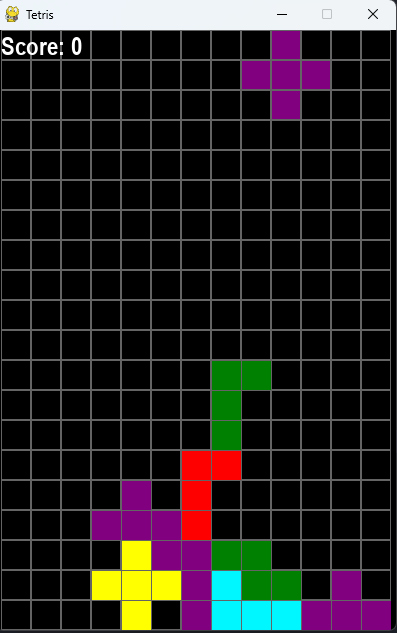

# Tetris Game with Python

This game is built with Python using the Pygame library.

## Gameplay

In Tetris, your goal is to manipulate different-shaped blocks as they fall from the top of the screen to create horizontal lines without any gaps. When you complete a line, it disappears, and you earn points. The game ends when the blocks stack up to the top of the screen



## Controls

- Up Arrow Key: Rotate the block
- Left Arrow Key: Move the block to the left
- Right Arrow Key: Move the block to the right
- Down Arrow Key: Accelerate the block down

## Installation

1. Clone this repository to your local machine:

```bash
 git https://github.com/Matheus-OAMK/Tetris-Python-Game.git
```

2. Install the required packages using pip:

```bash
 pip install -r requirements.txt
```

3. Run the game with the following command:

```bash
 python main.py
```
